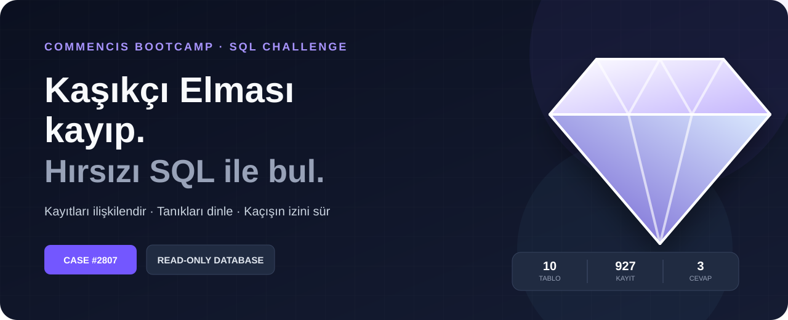
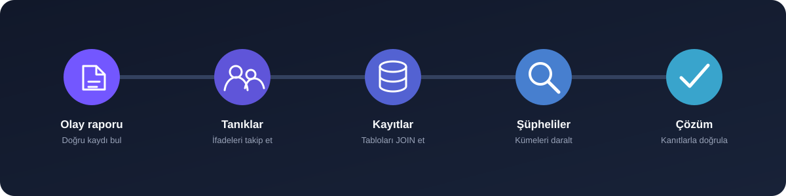

<div align="center">
  

  <h1>Catch the Thief 🔎</h1>

  <p><strong>Veritabanındaki izleri takip et, Kaşıkçı Elması'nı çalan hırsızı ortaya çıkar.</strong></p>

  <p>
    
    
    
  </p>
</div>

> **VAKA #2807** — 28 Temmuz 2024'te Topkapı Sarayı'nda Kaşıkçı Elması çalındı. Yetkililer, hırsızın olaydan kısa süre sonra Divan Yolu Caddesi çevresinde şüpheli bir işlem yaptığını ve ardından İstanbul'dan ayrıldığını düşünüyor.

Elindeki kayıtları ilişkilendir, tanıkları dinle ve kaçışın izini sür. Bu vakada sezgiler değil, **SQL sorguların ve kanıt zincirin** konuşacak.

<div align="center">
  <a href="https://github.com/mennansevim/dotnet-onboarding-catch-the-thief/releases/download/v1.0.0/istanbul_heist.db"><strong>⬇️ Veritabanını indir</strong></a>
  &nbsp;&nbsp;·&nbsp;&nbsp;
  <a href="#-hızlı-başlangıç"><strong>🚀 Araştırmaya başla</strong></a>
  &nbsp;&nbsp;·&nbsp;&nbsp;
  <a href="#-teslim"><strong>📬 Teslim adımları</strong></a>
</div>

---

## 🗂️ Vaka dosyası

| | Vaka bilgisi |
| :--- | :--- |
| **Olay** | Kaşıkçı Elması'nın çalınması |
| **Tarih** | 28 Temmuz 2024 |
| **Konum** | Topkapı Sarayı, İstanbul |
| **Materyal** | 10 ilişkili tablo · 927 kurgu kayıt |
| **Amaç** | Hırsızı, kaçtığı şehri ve suç ortağını bulmak |
| **Kural** | Yalnızca `SELECT` — veri değiştirmek yok |

### Yanıtlaman gerekenler

| 01 | 02 | 03 |
| :---: | :---: | :---: |
| **Hırsız kim?** | **Hangi şehre kaçtı?** | **Suç ortağı kim?** |
| Kimlik kayıtlarını eşleştir. | Uçuş rotasını doğrula. | İletişim izini takip et. |

> [!IMPORTANT]
> Yalnızca isimleri tahmin etmek yeterli değil. Her cevabı veritabanındaki kayıtlarla destekle ve araştırma adımlarını `log.sql` dosyasında açıkla.

## 🧭 Araştırma rotası

<div align="center">
  
</div>

İyi bir dedektif gibi ilerle: önce bağlamı bul, sonra tablolar arasındaki ilişkileri kur. Kayıt ID'lerini veya sonucu önceden varsayma.

## 🚀 Hızlı başlangıç

### 1. Veritabanını al

[**`istanbul_heist.db` dosyasını doğrudan indir →**](https://github.com/mennansevim/dotnet-onboarding-catch-the-thief/releases/download/v1.0.0/istanbul_heist.db)

Alternatif olarak [depodaki veritabanı](./istanbul_heist.db) sayfasından **Download raw file** seçeneğini kullanabilirsin. Veritabanı hazırdır; tablo oluşturman veya veri eklemen gerekmez.

### 2. Salt okunur aç

SQLite destekleyen herhangi bir uygulamayı kullanabilir veya terminalden bağlanabilirsin:

```sh
sqlite3 -readonly istanbul_heist.db
```

### 3. Masandaki dosyaları incele

```sql
SELECT name, sql
FROM sqlite_master
WHERE type = 'table'
ORDER BY name;
```

## 🧾 Elindeki kayıtlar

| Kayıt grubu | Tablolar | İçerik |
| :--- | :--- | :--- |
| **Vaka** | `crime_scene_reports`, `interviews` | Olay raporu ve tanık ifadeleri |
| **Güvenlik** | `topkapi_security_logs` | Otopark giriş/çıkış saatleri ve plakalar |
| **Kimlik** | `people` | İsim, telefon, pasaport numarası ve plaka |
| **Finans** | `bank_accounts`, `atm_transactions` | Hesap sahipleri ve ATM hareketleri |
| **İletişim** | `phone_calls` | Arayan, aranan, tarih ve görüşme süresi |
| **Seyahat** | `airports`, `flights`, `passengers` | Havalimanları, uçuşlar ve yolcu kayıtları |

<details>
<summary><strong>Veri formatı notları</strong></summary>

- Telefonlar `+905321234567` gibi boşluksuz saklanır.
- Güvenlik hareketleri `giriş` / `çıkış` biçimindedir.
- ATM işlem türleri `withdraw` (para çekme) / `deposit` (para yatırma) biçimindedir.
- Tarihler ayrı `year`, `month`, `day` sütunlarındadır.
- Tüm kayıtlar eğitim amacıyla kurgulanmıştır; gerçek veya eksiksiz operasyon kayıtları değildir.

</details>

## 💡 İlk ipucu

`crime_scene_reports` tablosunda **28 Temmuz 2024** ve **Topkapı Sarayı** ile ilgili kaydı bul. Olay raporundaki ayrıntılar seni tanık ifadelerine ve sonraki adımlara götürecek.

<details>
<summary><strong>Takıldım — ek ipuçlarını göster</strong></summary>

> İpuçlarını sırayla açmanı ve her adımdan sonra yeniden sorgu yazmayı denemeni öneririz.

1. 28 Temmuz'da **10:15–10:25** arasındaki Topkapı **çıkışlarını** incele; sınır saatleri dahil.
2. Aynı gün **Divan Yolu Caddesi** ATM'sinden **para çekenleri** bul.
3. Elde ettiğin şüpheli kümelerini kesiştir.
4. Şüphelinin aynı gün yaptığı **60 saniye veya daha kısa** aramaların alıcılarını araştır.
5. **29 Temmuz** İstanbul kalkışlı uçuşları saate göre sırala; İstanbul'daki tüm havalimanlarını dikkate al.
6. En erken uçuşun yolcu ve koltuk kayıtlarıyla bulgularını doğrula.

</details>

## 📬 Teslim

### Dosyalarını hazırla

[`sablon/`](./sablon/) klasöründeki başlangıç dosyalarını kendi ad-soyad klasörüne kopyala:

```text
cevaplar/
└── Ad-Soyad/
    ├── log.sql
    └── answers.txt
```

| Dosya | Beklenen içerik |
| :--- | :--- |
| **`log.sql`** | Sorguların araştırma sırasıyla; her sorgunun üstünde amacını ve bulgunu açıklayan `--` yorumları |
| **`answers.txt`** | `Thief`, `City` ve `Accomplice` alanlarının cevapları |

Klasör adına kendi adını ve soyadını yaz (örnek: `Ada-Kaya`). Aynı adla bir klasör varsa sonuna GitHub kullanıcı adını ekle: `Ada-Kaya-kullaniciadi`.

### GitHub üzerinden gönder

1. Bu depoyu sağ üstteki **Fork** düğmesiyle kendi hesabına kopyala.
2. Fork'unda **`cevaplar/`** klasörünü aç.
3. **Add file → Upload files** ile ad-soyad klasörünü yükle ve değişikliği commit et.
4. **Contribute → Open pull request** ile bu deponun `main` dalına Pull Request aç.
5. Başlığı **`Cevap: Ad Soyad`** olarak yaz ve gönder.

> [!WARNING]
> Yalnızca kendi cevap klasörünü ekle veya güncelle. Veritabanını, görev metnini ve diğer katılımcıların dosyalarını değiştirme; veritabanının kopyasını cevap klasörüne yükleme.

## ✅ Teslim kontrolü

- [ ] Klasörüm `cevaplar/Ad-Soyad/` biçiminde.
- [ ] `log.sql` yalnızca veri okuyan ve SQLite üzerinde çalışan sorgular içeriyor.
- [ ] Her sorgunun amacını ve ulaştığım bulguyu yorum satırlarıyla açıkladım.
- [ ] `answers.txt` içindeki üç alanı doldurdum.
- [ ] Sonuçlarımı tanık, güvenlik, ATM, telefon ve uçuş kayıtlarıyla destekledim.
- [ ] Pull Request'im yalnızca kendi cevap dosyalarımı değiştiriyor.

## 🛡️ Veritabanı doğrulaması

Başlangıç veritabanında **10 tablo ve 927 kayıt** bulunur. SQLite bütünlük ve yabancı anahtar kontrolleri yapılmış, ipucu zincirinin salt okunur `SELECT` sorgularıyla çalıştığı ve tek bir çözüme ulaştığı doğrulanmıştır.

---

<div align="center">
  <strong>Commencis Bootcamp için hazırlanmıştır.</strong>
  <br>
  <sub>Bu bulmaca, CS50'deki SQL dedektiflik alıştırmalarından esinlenilmiş bağımsız bir eğitim çalışmasıdır; CS50'nin resmî içeriği değildir.</sub>
</div>
